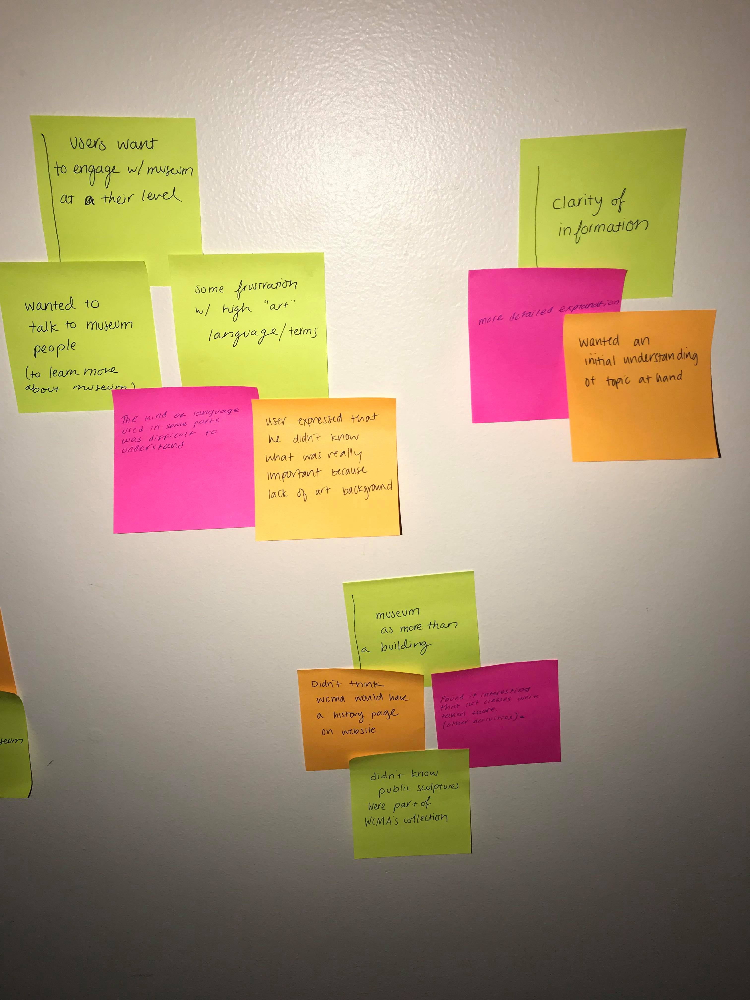
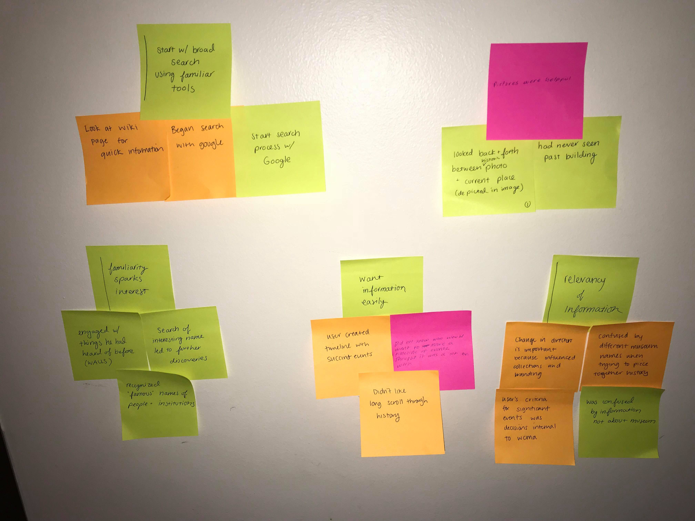

Through our contextual inquiry, we found that when people learn something new or see a name they recognize, it sparks a desire to learn even more. We hope that our design will cultivate and encourage that feeling in our users. However, one of the biggest challenges we faced designing and executing our contextual inquiry was that it is hard to judge what information people want to know, especially when it is not available or difficult to find.

We also found that people like to visualize information, especially through pictures. They provide a physical connection between the past and the present. We also learned that people are interested in being involved with special programs(WALLS) that may help them discover more about the museum.

# Participants

# Themes and Process

### Process

### Affinity Diagram

### Themes

# Task Analysis Questions

1. Who is going to use the design?

   Visitors of WCMA

2. What tasks do they now perform? (what do people do?)

   Currently, people look for information about the museum's history online (using Google, Wikipedia, or directly checking the WCMA website), they find historic photos and make connections between the museum's past and their own present.

3. What tasks are desired? (what do people want to do?)
  People want a more accessible, more engaging means of knowing a place's history. They want to be able to discover new information about
4. How are the tasks learned?
  Individuals have their own preferred methods and tools. For example, some automatically open up Google and start to type any keywords that come to mind, while others go straight to the WCMA site. People like to use tools with which they are familiar because they know how to use them.
5. Where are the tasks performed?
  Both in the location and not. A desire to learn more about a place can be especially sparked when someone is in that actual place, but it has the potential to extend far past the time when they are physically there. Because of the changes to the building itself, people find interest in the museum's history both while inside where they can see the shapes of the inner galleries, and also outside where they can see the overall building.
6. What is the relationship between the person and data?
  People want relevant data and they want it in language and a form they can understand. People respond very strongly and very well to pictures, largely because they convey a large amount of data (what something looked like, what took place) in a very quickly digestible format.
7. What other tools does the person have?
  They have the museum staff—security guards, the greeter, staff in the galleries—whom they can ask for both information and personal anecdotes.
8. How do people communicate with each other?
9. How often are the tasks performed?
  The outcome of performing a task affects if it performed again or more frequently. When people look up information, if they like what they found, they may be inspired to look up something more specific or something that arose from that initial search.
10. What are the time constraints on the tasks?
  The largest time constraint is the person's attention span to remain interested in finding the information they are looking for. If information is not quickly or easily accessible, people lose interest and stop pursuing it.
11. What happens when things go wrong?
  People get confused and frustrated. They give up, stop their search, and do not learn anything new. They are also less likely to trust that the next time they want to know something that they will be able to find it.
