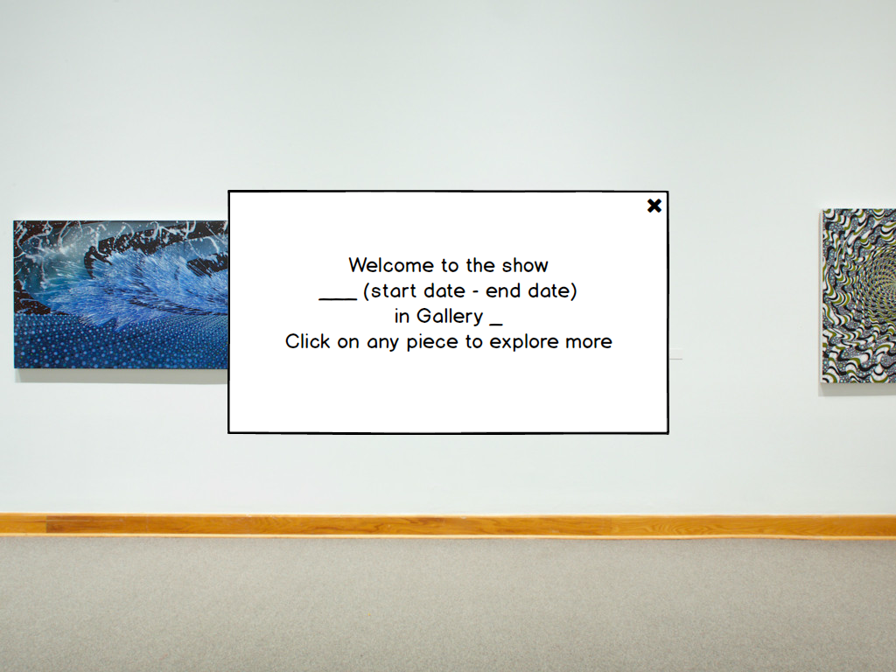
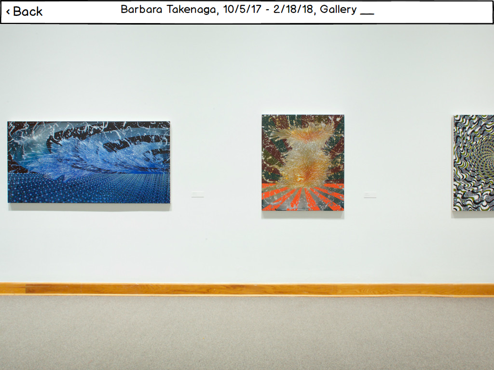
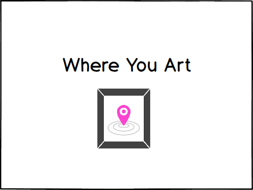
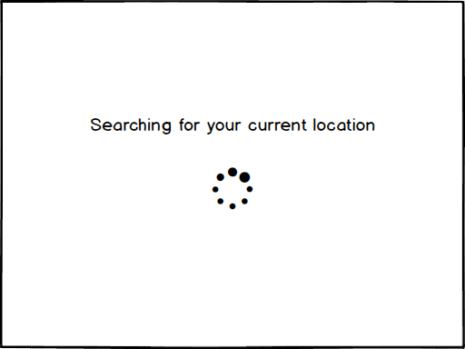
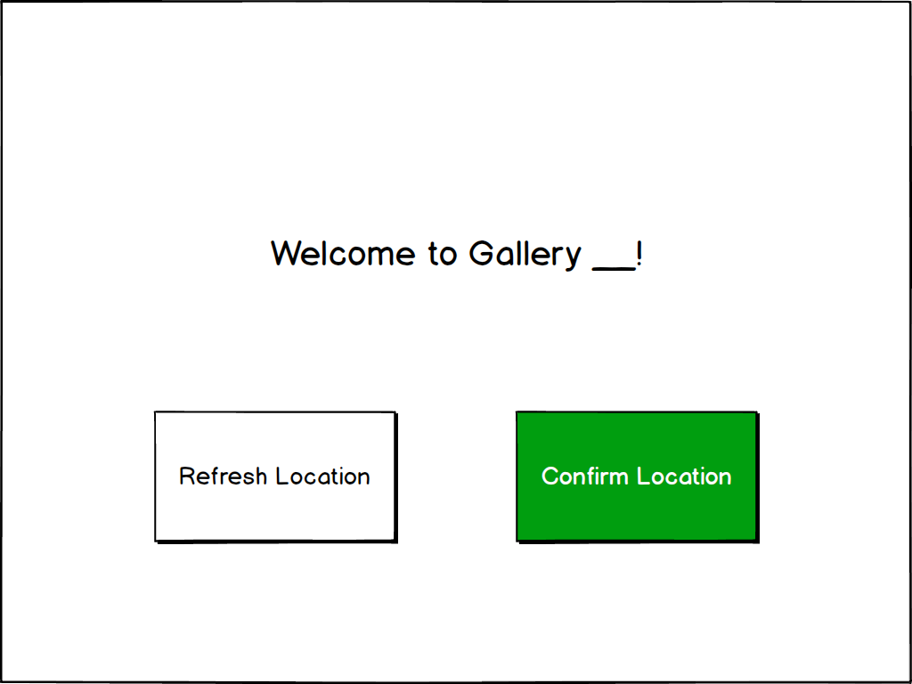
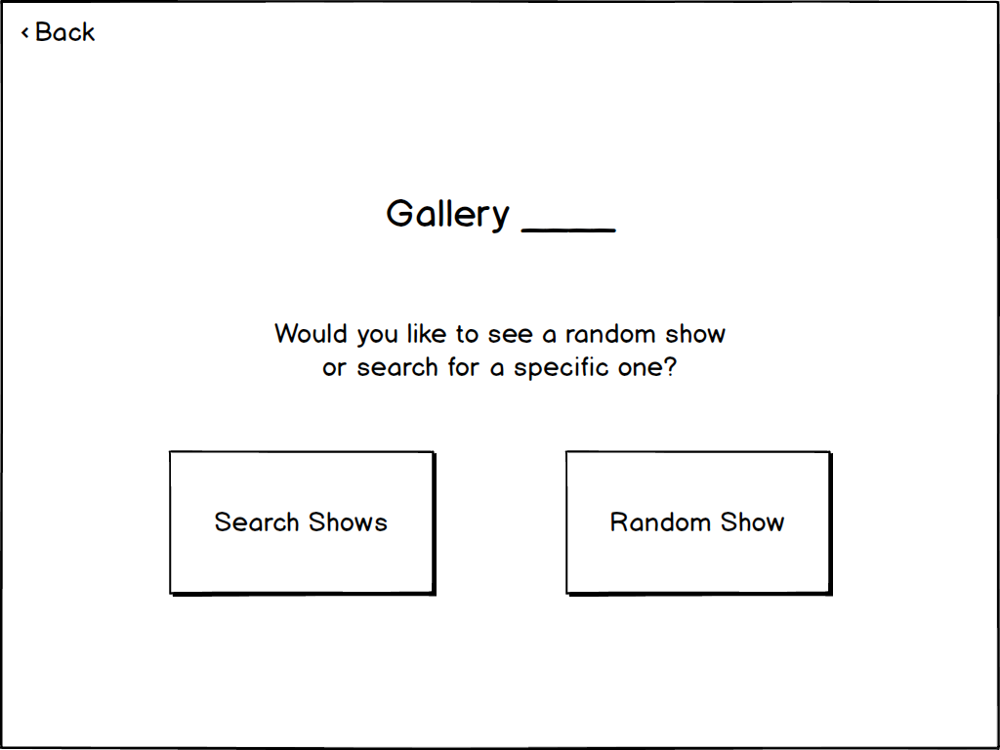
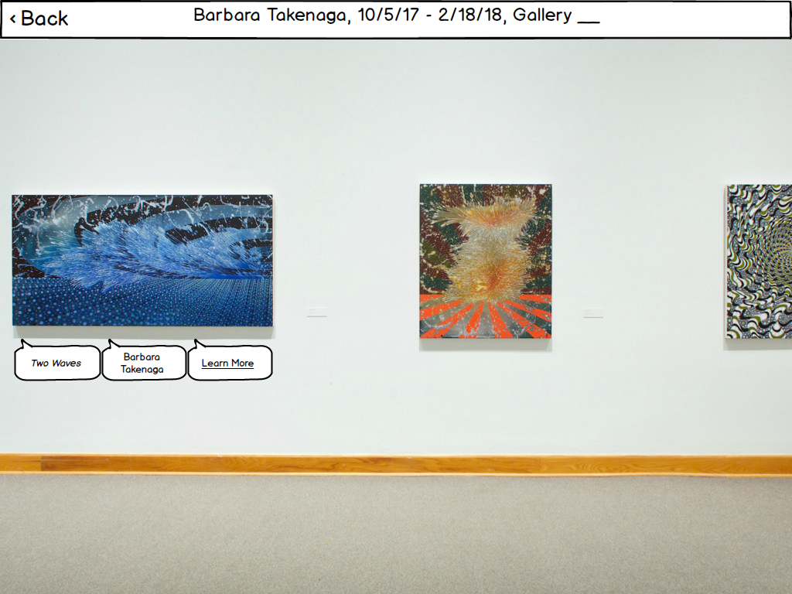
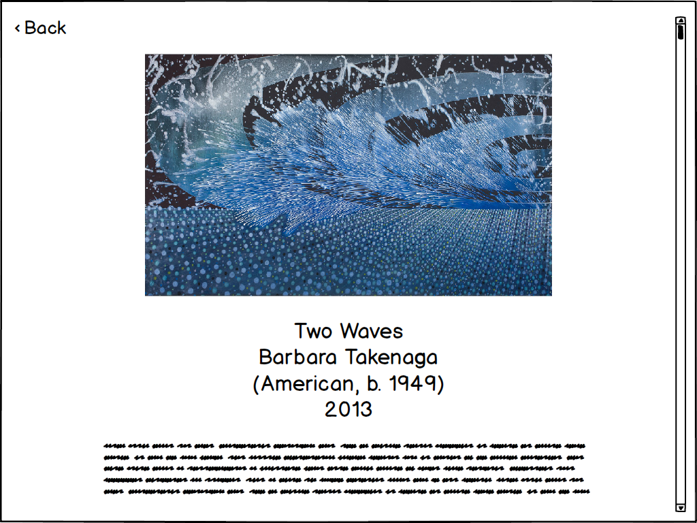

## Overview: 

Where You Art is an AR app. This is an overview of our digital mockup, made using InVision and Balsamiq.

#### Opening Screen
The opening screen features our logo.

After, our app transitions to a screen that detects the location of the user in the museum. 

Once our app detects the user's location, it asks the user to confirm if they are currently in the gallery detected. If our app detected the wrong location, the user can refresh and our app would try again to detect the user's location.

## Task 1: View past gallery 

Once the user confirms their location, our app prompts the user and asks whether they'd like the app to randomly choose a show and project it or whether the user would like to search for a specific gallery.

Once the user selects a show, our app superimposes the art pieces from the past show onto the current gallery space. There is a pop-up welcoming the user with information about the dates of the past show and the current space they are in.

Once the user closes the opening pop-up box by touching the 'x' at the top right corner, they are able to explore the gallery.

## Task 2: Interact with past gallery

Given that the user performed the first task, they can now interact the art pieces of a past gallery. By tapping on any of the art pieces, the app displays information bubbles with the title of the piece, the artist, and the option to learn more.

If the user chooses the option to learn more, the app will pop up a screen with more information. 

## Discussion of Changes
Throughout our usability testing, we have made a number of significant changes that make our application much simpler and intuitive to use. One of the most significant changes was the addition of a back button to provide users with navigational freedom within the application. A common occurrence during the  usability testing process was that some of the participants would get a bit confused in terms of trying to find out what they can and cannot do. We therefore changed the look and words used in some of the prompts to clearly explain their options. On the location confirmation screen, we made use of additional visual cues by making the “confirm location” button green. 
We have also incorporated the use of more informative prompts, like the one the user receives before choosing between “search shows” and "random shoes”, slightly informs the user on what to expect with every choice.
Before users start exploring a gallery, a prompt informs them that they can explore more about any installation by clicking on them, since this was a feature that was not easily recognized by all participants. 
Of the three pop up bubbles that appear when the user clicks on an image, we decided to have the “learn more” bubble underlined as an indication that it was the only one that could be clicked to display more information. We decided on this after one of the participants tried to click on the “name” bubble, expecting feedback.
