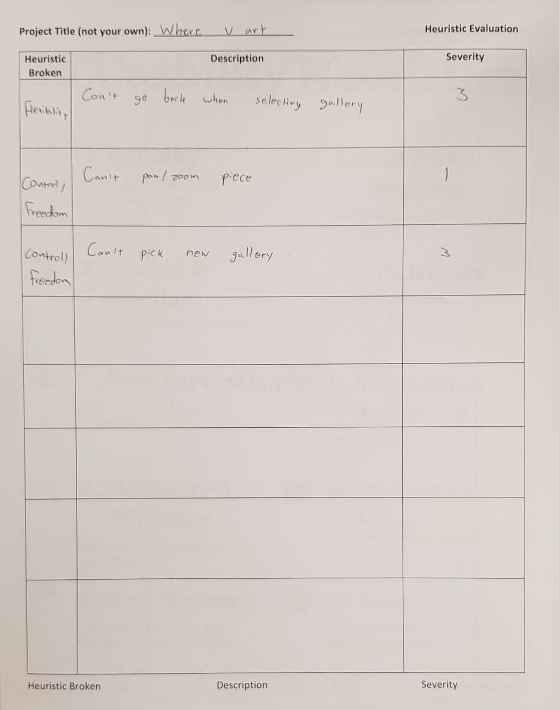
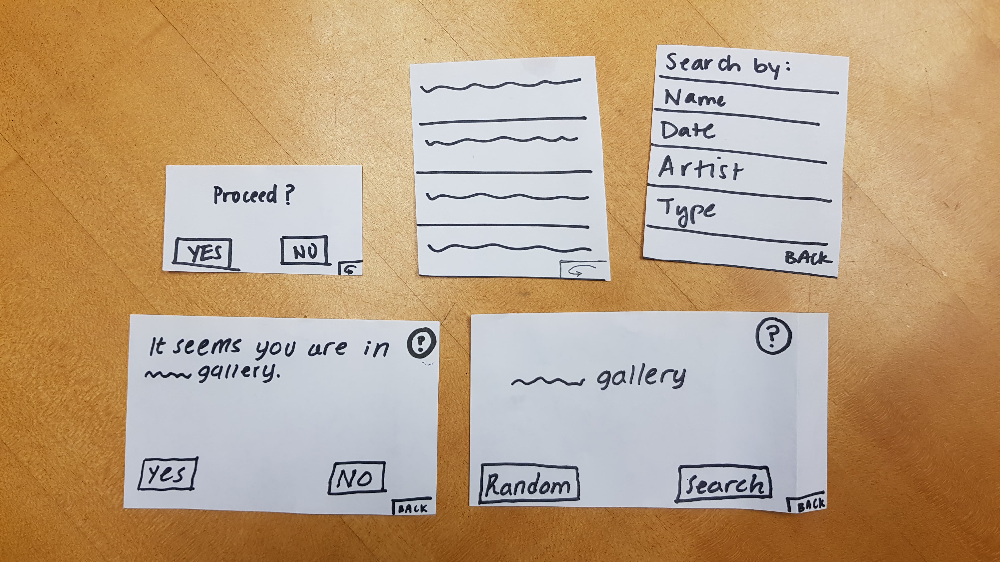
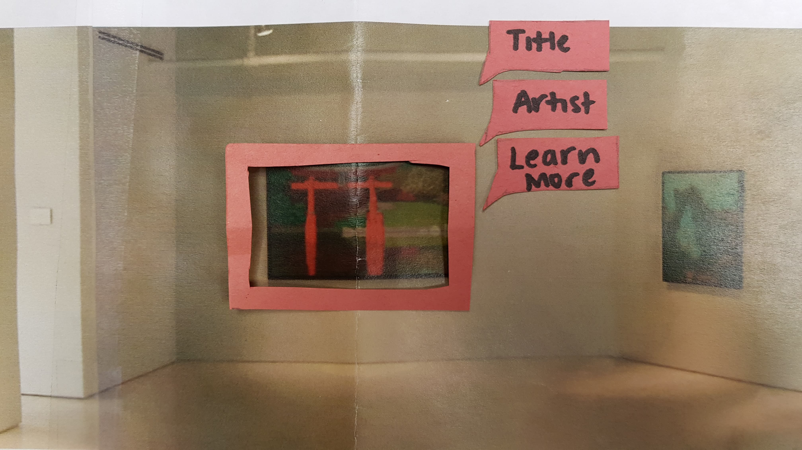
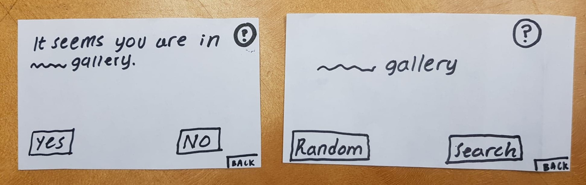
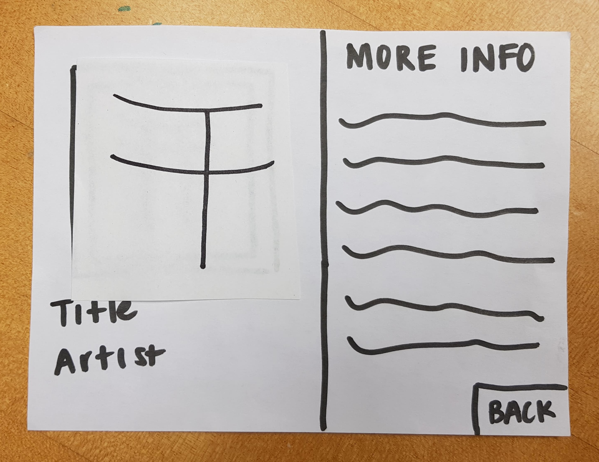
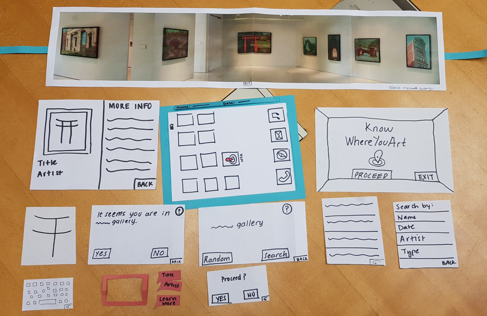

## Table

Heuristic Broken | Description | Severity
---------------- | ----------- | ----------
Control & Freedom | User cannot go back to previous screens  | 2
Visibility | Once a gallery is selected, the artworks are not highlighted | 1
Control & Freedom | Cannot exit app after opening | 4
Help | No explanation of what "random" means as opposed to "search" | 3
Flexibility & Efficiency | Can't switch between galleries | 4
Flexbility & Efficiency | Can't go back when selecting gallery | 3
Control & Freedom | Can't pan/zoom piece | 1

## Evaluation 1:
#### Conducted by: Steve
#### Facilitated by: Daniel and Spencer

## Evaluation 2:
#### Conducted by: Linda and Julia
#### Facilitated by: Javi

## Revisions

#### 1) Back buttons

One of the main issues that was identified during the evaluations was the option to navigate backwards to previous screens or going back to select different galleries. We made revisions of this below. The lack of these buttons made it difficult to provide flexibility to the user if they made a mistake or changed their mind. In addition, this prevented them from exploring the app in its entirety.

#### 2) Highlight selected piece

Another revision we made we made was highlighting the piece in the gallery that user wants to interact with. This wasn't something we'd thought about, but think it can be useful in indicating to the user what they selected and can serve as feedback to user that the app is working.

#### 3) Help 

We made changes to provide help to the users if they weren't sure what the app was supposed to do. To provide help, we included a question mark button, which would direct the user to a new screen that provides more information.

#### 4) Pan & Zoom
We included a pan and zoom option when the user wants to learn more about a piece of artwork. In this picture, the new piece is supposed to show a zoomed in version of one of the art pieces

#### 5) Keyboard
We overlooked that we needed a keyboard in our prototype for when the user wants to search for a gallery

![keyboard] (img/heuristic_eval/new_keyboard.jpg)

## Overview

This is the pieces of our revised prototype, which includes the revisions we made.

