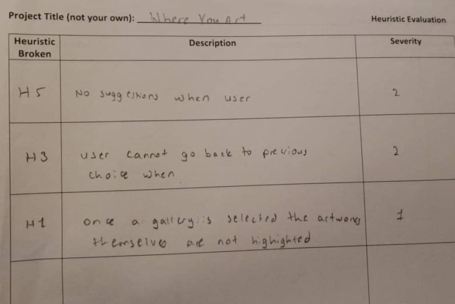
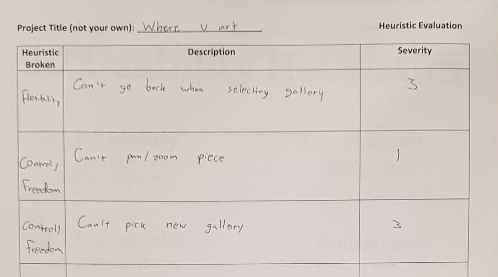

## Table

Heuristic Broken | Description | Severity
---------------- | ----------- | ----------
Control & Freedom | User cannot go back to previous choice  | 2
Visibility | Once a gallery is selected, the artworks are not highlighted | 1
Control & Freedom | Cannot exit app when opening | 4
Help | No explanation of what "random" means as opposed to "search" | 3
Flexibility & Efficiency | Can't switch between galleries | 4
Flexbility & Efficiency | Can't go back when selecting gallery | 3
Control & Freedom | Can't pan/zoom piece | 1

## Evaluation 1:
#### Conducted by: Steve
#### Facilitated by: Daniel and Spencer

#### List of results:

## Evaluation 2:
#### Conducted by: Linda and Julia
#### Facilitated by: Javi

#### Identified issues
One of the main issues that was identified during the evaluations, was the luck of providing the user 
with a way to navigate back to previous pages.

