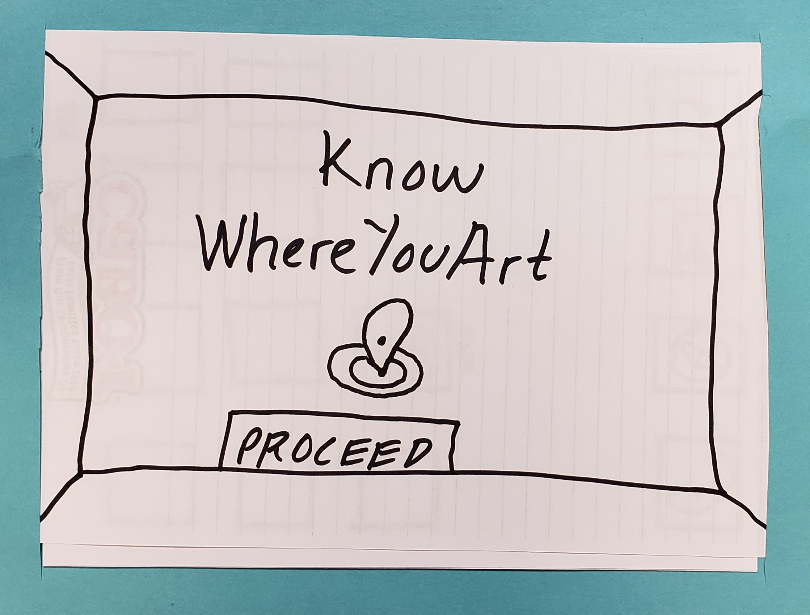
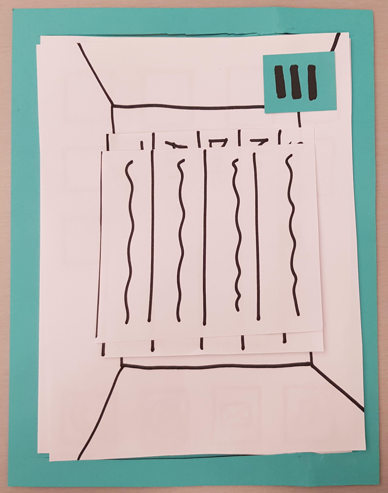
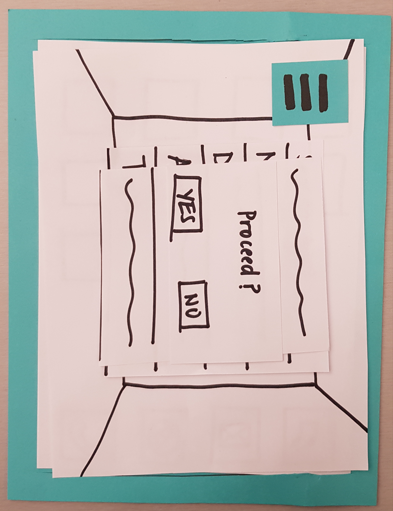

## Home Screen
This is the first screen the users see when a user clicks on the application's icon to open it.

{:height="50%" width="50%"}

## User location detection
The application will detect the user's location within the museum so as to be able to present relevant installations. The user will be asked to confirm that the location displayed is actually where they are. If not, the application will recalibrate and ask the user to confirm the location again.

{:height="50%" width="50%"}

## 
Once the user confirms their location, they will be prompted to choose between a random view of the gallery's installations, or search for something specific.

{:height="50%" width="50%"}

## Task: View past gallery

### 1) Randomized Gallery

{:height="50%" width="50%"}

### 2) User Search

{:height="50%" width="50%"}

{:height="50%" width="50%"}

{:height="50%" width="50%"}

{:height="50%" width="50%"}

## Task: Interact with past gallery

{:height="50%" width="50%"}

{:height="50%" width="50%"}

## The Big Picture

Image Source: [The Fishbach Gallery](http://www.bradmarshallart.com/gallerypan07.htm)
