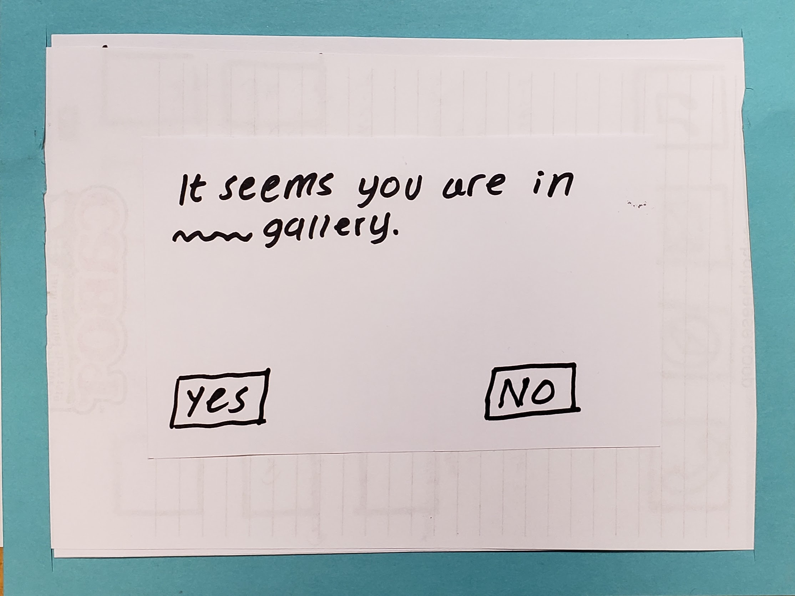

## Home Screen
This is the first screen the users see when a user clicks on the application's icon to open it.

{:height="50%" width="50%"}

## User location detection
The application will detect the user's location within the museum so as to be able to present relevant installations. The user will be asked to confirm that the location displayed is actually where they are. If not, the application will recalibrate and ask the user to confirm the location again.

{:height="50%" width="50%"}

## Gallery Choice

Once the user confirms their location, they will be prompted to choose between a random view of the gallery's installations, or search for something specific.

{:height="50%" width="50%"}

## Task: View past gallery

### 1) Randomized Gallery
When the user selects to view installations randomly, they are shown previous installations from a random time period. As the user walks around, the installations that they users have already seen will change to other installations.
{:height="50%" width="50%"}

### 2) User Search

{:height="50%" width="50%"}

If the user chooses to not to display a random gallery, they have the option to search for a past gallery. 

{:height="50%" width="50%"}

They can search by name, date, artist, or type. The app displays an auto-fill as the user types. 

{:height="50%" width="50%"}

Once the user selects a gallery to view, the app prompts them to confirm their selection.

{:height="50%" width="50%"}

After the user confirms, the app displays the gallery.

## Task: Interact with past gallery

{:height="50%" width="50%"}

Once a user is viewing a past gallery, they can touch an art piece and the app displays the title and artist of the piece. In addition, they have to option to learn more by clicking on the “Learn more” information bubble.

{:height="50%" width="50%"}

The app displays a more detailed explanation of the art piece for the user. The user can return to the gallery by selecting the back option.

## The Big Picture 

Image Source: [The Fishbach Gallery](http://www.bradmarshallart.com/gallerypan07.htm)
