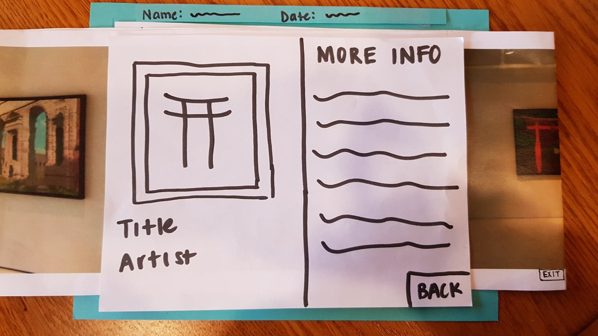

## Protocol
Our first usability test was conducted in one of the common rooms in Lehman, with a fourth year Computer Science major student, Kim (a Lehman resident), as our participant. Our aim was to make Kim as comfortable as possible throughout this exercise, which influenced our decision in picking Lehman as the test site. We started by welcoming the  participant and asking if it was ok to take notes as he went through the process. We then moved on to providing a brief overview our project and application design, and encouraged the participant to be vocal throughout the process, making it clear that his feedback would be very useful towards improving our product.

#### Task 1 - Interact with a random art piece
  - Confirm location
  - Choose a gallery
  - Choose a piece
  - Gather more information about that piece
  - Look closely at piece

#### Task 2 - View an exhibition in the gallery from 2010
  - Confirm location
  - Start a search
  - Enter criteria
  - Select show

## Cognitive Walk-Through
- Action of selecting artwork to display more information about it is not visible (3)

We haven't yet revised this as we are still in discussion of the various ways we can solve this problem such as adding highlighting around every frame (without the user needing to tap them) or adding an animation of a finger tap to show the user the supported action. We also believe that once a user knows this is an existing action they can take, it is relatively natural, so having an introductory tutorial for the app may also be a solution. This highlighting solution is imaged below. 

- Action of zooming in on image of artwork is not visible (1)

Since this is an action that is widely used in various designs, we do not find it critical that this action is not visible.

![after zoom] (after_zoom.jpg) 

## Usability Test

For our first usability test, Julia and Linda took notes and Steve was the computer. From this usability test, we learned several things. The first was that it's really easy to overlook simple things as designers, for example, the inclusion of a heading to clarify what a screen is for. Although our paper prototype isn't supposed to be the real thing, it shouldn't oversimplify the actual app, which in some instances we did. The unlabeled components were obvious to us but the user wouldn't know what to make of the unlabeled list. In addition, we learned that it's important to provide a brief overview of our design to the user before testing. 

### Critical Incidents

**1) Confusion with "______" gallery screen, Severity: 2**

On the screen indicating the user what gallery they are currenty in, the user asked us for clarification about what it meant. In addition, the user was confused about the "Random" and "Search" buttons. We had to give Kim an explanation of what our intentions for each button were. The bottom image was originally shown if the user clicked on the question mark symbol, but we figured we could include that information into the main screen to make it clear what the app is supposed to do.

**2) Indicate that art pieces are clickable, Severity: 3**

During our test, we had to tell Kim that he was able to click on each art piece. We need to include some type of signifier that the user can click on each art piece. Possible revisions can be to clearly highlight the frames of each art piece or to adding an animation of a finger that the user should click. A possible revision is highlighting the art pieces without once the gallery is shown.

**3) Search, Severity: 4**

We didn't include a search button on the search screen. Although Kim was able to search with the keyboard, there was no way for him to complete the actual search. In addition, we thought it would be helpful to users if we provided examples of what each search criteria looked like. 

**4) Search Results Heading, Severity: 2**

After Kim did his search for a 2010 gallery, we had to explain to him what the list was, and so it would be helpful to insert a search heading indicating what the list is. We added a heading, pictured below.

### Positive Feedback

Overall, We had mostly positive feedback from our user about the prototype. He indicated that he thought the idea was cool. The interaction was very smooth--he completed the tasks relatively naturally and minimal guidance. This suggests to us that Kim was someone who was already familiar with this type of technology and that we should branch out in our selection of users for testing.

## Overview

### Task 1 Components - Interact with a random art piece 

### Task 2 Components - View an exhibition in the gallery from 2010

## Plan

Some aspects of functionality that may seem obvious to us may not be so obvious to other people. In a bid to make our product more inclusive, it is important that we take note of some of the features of our product that may not stand out to a user who is not tech savvy. For our next usability test, we therefore plan to have a participant who considers him/herself as a person who is not tech savvy. We also plan to shift responsibilities, giving every member of the team a chance to experience different roles. 
