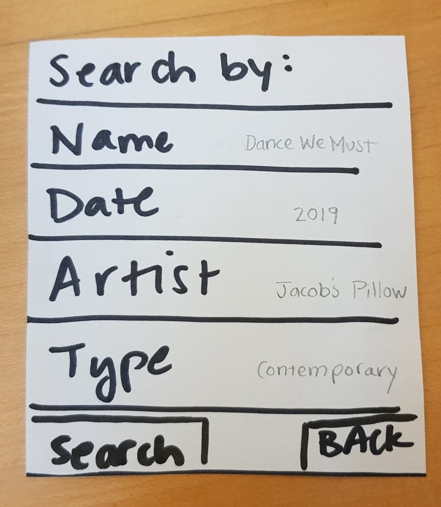
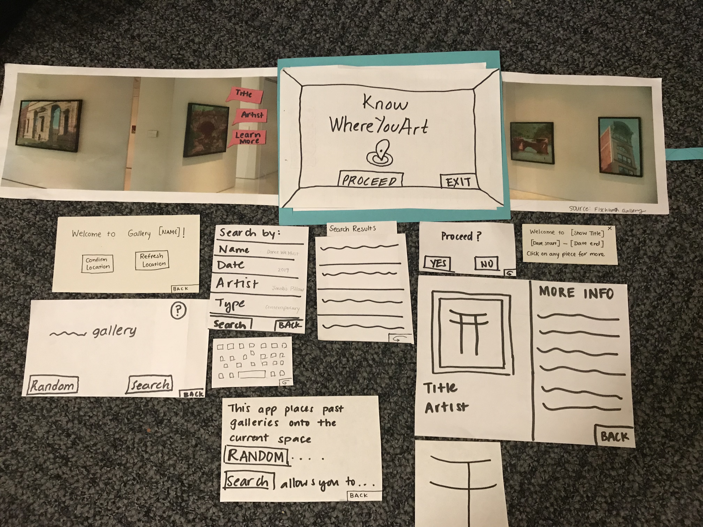
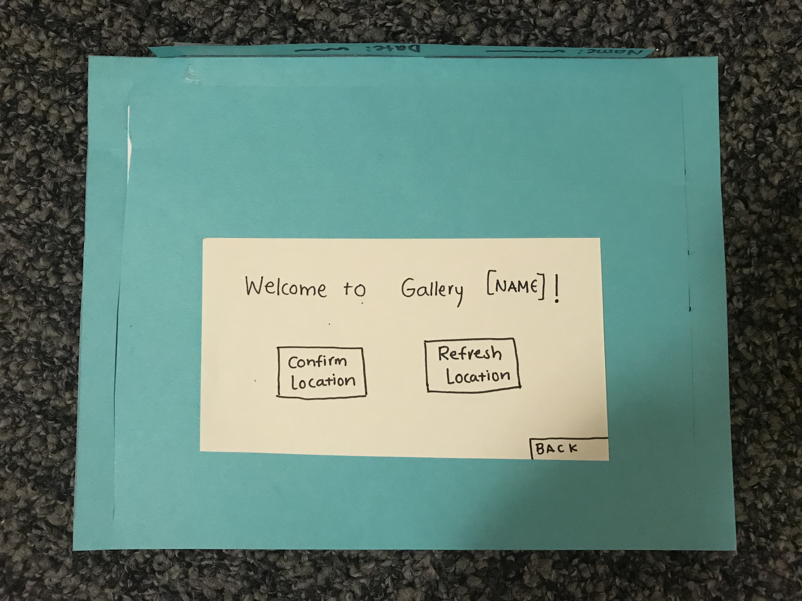
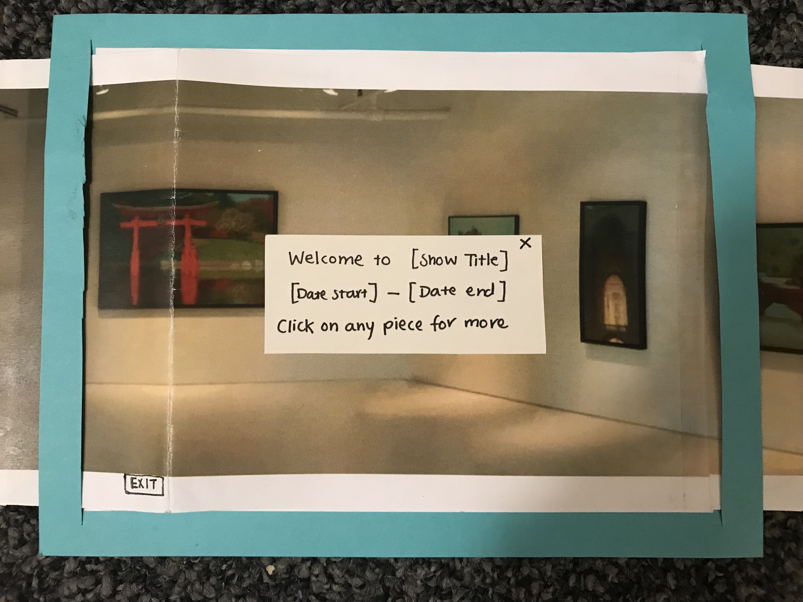
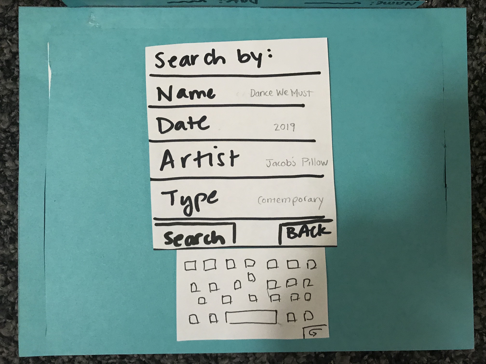

## Testing Protocol

Users were asked to think aloud and explain to us their actions and the reasoning behind them as they interacted with our paper prototype. In all tests we worked to create a space in which the user could feel comfortable doing this and were sure to hold our tests in relatively quiet areas where this was possible. In each our tests, we started by welcoming the participant and asking if it was ok to take notes as he went through the process. We then moved on to providing a brief overview our project and application design, and encouraged the participant to be vocal throughout the process, making it clear that his feedback would be very useful towards improving our product.

We asked each user to complete two tasks:
- Interact with a random art piece
- View an exhibition in the current gallery from 2010

We took turns being the 'computer' for each test, with the other group members being note takers.

### Usability Test 1
  - Participant: Kim, Computer Science major. Kim was chosen primarily because of scheduling conveniences, but as someone relatively familiar with AR, was able to understand the concept of our design and from there provide good insight on the design itself.
  - Location: A common room in Kim's building. A quiet space that would be comfortable for them.
  - Computer: Steve

### Usability Test 2
  - Participant: Caroline, Anthropology major. Caroline was chosen after our first usability test because we wanted to diversify who tested our design i.e. choose someone who might be less familiar with AR technology. Caroline had a natural understanding of how to use the app and stated she has encountered technology like this before. She suggested one of our major revisions, where the opening screen should say something along the lines of "Welcome to __ gallery...".
  - Location: Eco cafe. A central location with tables, good lighting, and minimal distractions
  - Computer: Linda

### Usability Test 3
  - Participant: Aimer, a Chemistry major. As much as Aimer had a relatively easy time using and understanding how the application works, some of the features in the application were not as obvious to her. In particular, being able to click on a piece to display more information about it did not seem like an option that was available.
  - Location: Upstairs Paresky, chosen by the participant to make the meeting as convinient for her as possible.
  - Computer: Julia

## Usability Test Results

### Usability Test 1
#### Critical Incidents

**1) Confusion with "______" gallery screen, Severity: 2**

On the screen indicating the user what gallery they are currenty in, the user asked us for clarification about what it meant. In addition, the user was confused about the "Random" and "Search" buttons. We had to give Kim an explanation of what our intentions for each button were. The bottom image was originally shown if the user clicked on the question mark symbol, but we figured we could include that information into the main screen to make it clear what the app is supposed to do.

**2) Indicate that art pieces are clickable, Severity: 3**

During our test, we had to tell Kim that he was able to click on each art piece. We need to include some type of signifier that the user can click on each art piece. Possible revisions can be to clearly highlight the frames of each art piece or to adding an animation of a finger that the user should click. A possible revision is highlighting the art pieces without once the gallery is shown.

**3) Search, Severity: 4**

We didn't include a search button on the search screen. Although Kim was able to search with the keyboard, there was no way for him to complete the actual search. In addition, we thought it would be helpful to users if we provided examples of what each search criteria looked like. 

**4) Search Results Heading, Severity: 2**

After Kim did his search for a 2010 gallery, we had to explain to him what the list was, and so it would be helpful to insert a search heading indicating what the list is. We added a heading, pictured below.

### Positive Feedback

Overall, We had mostly positive feedback from our user about the prototype. He indicated that he thought the idea was cool. The interaction was very smooth--he completed the tasks relatively naturally and minimal guidance. This suggests to us that Kim was someone who was already familiar with this type of technology and that we should branch out in our selection of users for testing.

### Usability Test 2

**1) Welcome screen of our app was confusing, Severity: 2**

Our user asked us to clarify what the text on this screen meant because it wasn't clear what the app is doing here. After we told her that it was to confirm the location, she suggested as an alternative that the screen should be something of the form, "Welcome to ___ gallery. Please confirm your location"

**2) Search Results Ambiguous, Severity: 2**

Caroline asked us to clarify what each of the items in the search results. After explaining to her that each item was meant to be a gallery from the year 2010, she understood that she had to choose one to and the gallery would be projected using the app. 

### Usability Test 3
**1) Art pieces aren't clearly highlighted for more information, Severity: 3**

In our last usability test, the user didn't know that she could click on the art pieces as there weren't signifiers for that action.

      
## Paper Prototype

### Overview

Here is an overview of our paper prototype and its components

### Task 1 - Interact with a random piece of art

User confirms their location

Select a random show

Select a piece to show more information

"learn more" shows even more information

### Task 2 - Explore a show from 2010

User confirms their location

## Significant Revisions
- One of the screens that our test users found most confusing was the one where the user was meant to confirm their location. Originally it said "It seems you are in __ gallery" with "yes" and "no" buttons underneath. The sense of uncertainty communicated in the wording, namely the "it seems" in addition to a yes/no option to a seemingly not yes/no question was very confusing for users. We changed this screen to read "Welcome to __ Gallery" with the option to either "confirm location" or "refresh location"
- We needed a way to let the user know that they are able to tap on the art pieces they see in the AR for more information and further interaction. Our test users, especially those with limited experience using AR or museum technology, didn't even think this was an action available to them. To convey this, and provide more of a welcome when the user enters the AR version of their gallery, we added a new pop-up that introduces the show's name and display dates, and additionally informs the user they can tap on pieces for further exploration.
