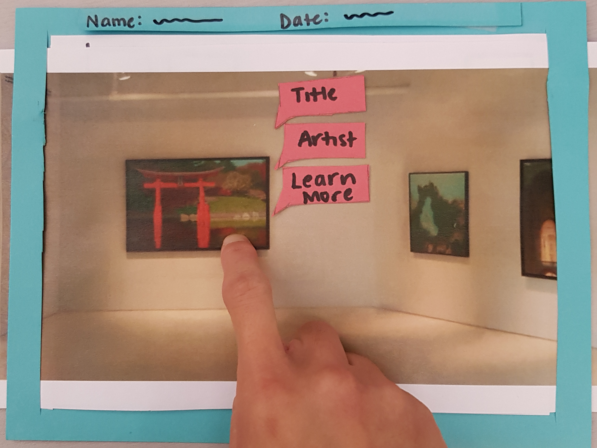
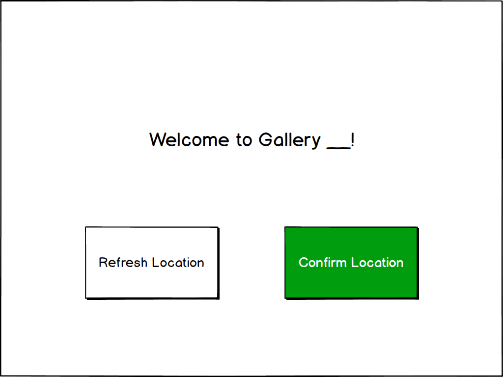

# Where You Art

## Team Members
Julia Kawano - Designer/ Researcher

Steve Omondi - Designer/ Researcher

Linda Zeng - Designer/ Researcher

## Problem and Solution Overview

You walk into an art museum and enjoy the exhibitions currently on display, but then you begin to wonder about previous shows. You wonder what they looked like, what pieces they had, and you wish there was a way to see, not only the museum space in its current state, but also galleries of the past. We have chosen to focus on the problems associated with the limitations of physical space and allowing museum visitors to learn more about where they are. Our proposed solution is an augmented reality mobile application that would allow visitors to view and interact with past exhibitions and their art.

Read our full proposal [here](https://omondieric.github.io/whereYouArt/proposal/)

## Initial Paper Prototype

      
We created a physical, paper prototype of our design. To simulate the AR component, we used an image of a gallery that we slid accordingly as a user held up the 'device' and turned from side to side to look around. 

The app detects the user’s location and asks them to confirm. Once the user confirms, they have the option to either view a random gallery or search for a specific one. 

The first task is to view a past gallery.

The second task is to interact with a past gallery 

See more details of our paper prototype here [link to paper prototype]

## Testing Process

Our testing process began with a heuristic evaluation with another team in the class. In this step, our design was evaluated against a list of design heuristics. 

The next step of our testing process was a cognitive walkthrough, which was where we walked through the steps of our two tasks. We considered these questions for each step:

1.Will the person be trying to produce whatever effect the action has?
2.Will the person be able to notice that the correct action is available?
3.Once the person finds the correct action at the interface, will they know that it is the right one for the effect they are trying to produce?
4.After the action is taken, will the person understand the feedback given?

### Usability Testing

For each of our three tests, we asked our user to complete two tasks:
1. Interact with a random art piece
2. View an exhibition in the current gallery from 2010

In all tests we worked to create a space in which the user could feel comfortable doing this and were sure to hold our tests in relatively quiet areas where this was possible. In each our tests, we started by welcoming the participant and asking if it was ok to take notes as he went through the process. We then moved on to providing a brief overview our project and application design. We encouraged users to think aloud and explain both their actions and their reasoning behind them as they interacted with the prototype. We rotated through the role of the ‘computer’ for each test, with the other group members being note takers.

Read our [usability testing review](https://omondieric.github.io/whereYouArt/usability-test/usability-test-review/) for more details on our process and participants.

## Testing Results

Throughout our testing process, we identified several issues and make refinements. 

#### Provide back buttons consistently so users never get trapped in the design 

From our heuristic evaluation, we realized that we didn’t have any back buttons. This was so easily overlooked and it didn’t occur to us to include them. We included them before our first usability test.

#### Highlight selected piece to user 

From our heuristic evaluation, someone from another team suggested to us that it would be helpful to highlight an art piece when a user taps it. This would serve as a signifier and feedback to the user that their action of tapping did something in our app. We subsequently made the change in our prototype before our first usability test.

#### Search form filled with example formats to minimize user memory load.

After our first usability testing, we thought it would be helpful if we provided examples of what each search criteria looked like. This is reflective of minimizing the memory load heuristic. 

#### Search heading 

From our second usability test, we learned that our search results list was extremely ambiguous and as a result, we had to explain to our participant what the search list was supposed to represent. To resolve this issue, we included a heading to the list to clearly indicate what it was.

#### Better wording for welcome screen  

From our second usability test, our participant asked us to clarify the gallery confirmation screen. After performing the tasks, she suggested to us that changing to wording on the screen would clarify the purpose of the screen. She suggested that we change the wording to “Welcome to _____ gallery,” and this was helpful feedback. We refined our prototype to reflect her suggestions.

#### Include signifiers to inform user of the ability to interact with a piece

From our usability tests, some of our participants weren’t aware that they were able to tap on art pieces in the gallery. To resolve this, we included a signifier i.e. include subtle pre-highlighting on the art pieces to signify to users that they are able to iap on the art pieces.

## Final Paper Prototype
After both usability testing and heuristic evaluations, we came to a final paper prototype that incorporated necessary changes to solve problems that came up during testing. Critical aspects:
      - The gallery confirmation screen was changed to read “Welcome to __ gallery” with options to either “confirm location” or “refresh location”.
      - Added a new pop-up that introduces the show’s name and display dates, and additionally informs the user they can tap on pieces for further exploration.

Our two primary tasks were:
1. Interact with a random art piece

2. View an exhibition in the current gallery from 2010

User confirms their location

## Digital Mockup

Critical aspects:
      - Addition of visual cues to some of the prompts, where necessary. For example, the screen that asks the user to confirm their location has the “confirm location” option colored green. also , when the user clicks on a piece to display the pop up options, the “learn more” option is underlined as a cue that it is the clickable bubble.

The opening screen features our logo.

The app will detect the location of the user in the museum. 

The user will confirm if they are currently in the gallery detected. If our app detected the wrong location, the user can refresh and our app would try again to detect the user's location.

#### Task 1: View past gallery 
User is asked whether they'd like the app to randomly choose a show and project it or whether the user would like to search for a specific gallery.

Once the user selects a show, our app superimposes the art pieces from the past show onto the current gallery space. There is a pop-up welcoming the user with information about the dates of the past show and the current space they are in.

Once the user closes the opening pop-up box, they are able to explore the gallery.

#### Task 2: Interact with past gallery

Given that the user performed the first task, they can now interact the art pieces of a past gallery. By tapping on any of the art pieces, the app displays information bubbles with the title of the piece, the artist, and the option to learn more.

## Discussion

From the process of iterative design, we learned that as designers our ideas may not always translate to the correct design and that iterations are helpful in getting it right. For example, the initial iteration of our search results was pretty ambiguous to our first participant, but to us, we knew what the ambiguous was supposed to be. This is an example of the recurring theme in this course that the user is not like you. 

The process shaped our final design because with each step, we refined our design based on each step of our testing process. We found the usability tests to be especially helpful in helping us refine our design as we gained the perspective of a user actually using the paper prototype. For example, adding a heading to our search results to remove ambiguity came from our first usability test. Another major change was changing the wording of our welcome screen, and this was a result from our second usability test.

Our tasks remain the same as before we conducted our user research, however, for the usability tests, we made them more specific to test specific aspects of our prototype. For example, we changed our initial task of viewing a gallery to viewing a gallery from 2010 to test the search option during our usability tests.

I think the iterations were helpful for us to refine the ideas initially proposed in our paper prototype, and more iterations are helpful for further refinement. However, I think we might have benefitted, not from more iterations, but the time and perhaps a different type of review with which we could have done a more general evaluation of our design. 

## Appendix

1. [First Paper Prototype](https://omondieric.github.io/whereYouArt/paper_prototype/paper-prototype/)
2. [Heuristic Evaluation](https://omondieric.github.io/whereYouArt/heuristic_eval/)
3. [Usability Test Check-In](https://omondieric.github.io/whereYouArt/usability-test/usability-test-checkin/)
4. [Usability Testing Review](https://omondieric.github.io/whereYouArt/usability-test/usability-test-review/)
5. [Digital Mock-Up](https://omondieric.github.io/whereYouArt/digital-mockup/digital-mockup/)
6. [Presentation](https://docs.google.com/presentation/d/1AdVMTL7fQWMRjYkDfYrM2I8IIhAhOx3nJm01WNjpuss/edit?usp=sharing)
